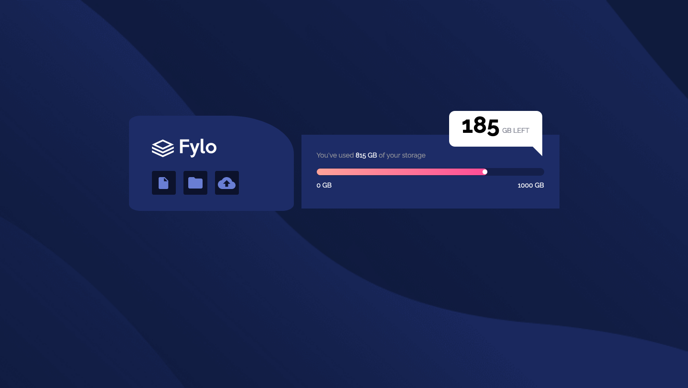

# Frontend Mentor - Fylo data storage component solution

This is a solution to the [Fylo data storage component challenge on Frontend Mentor](https://www.frontendmentor.io/challenges/fylo-data-storage-component-1dZPRbV5n). Frontend Mentor challenges help you improve your coding skills by building realistic projects. 

## Table of contents

- [Overview](#overview)
  - [The challenge](#the-challenge)
  - [Screenshot](#screenshot)
  - [Links](#links)
- [My process](#my-process)
  - [Built with](#built-with)
  - [What I learned](#what-i-learned)
  - [Continued development](#continued-development)
  - [Useful resources](#useful-resources)
- [Author](#author)


## Overview

### The challenge

Users should be able to:

- View the optimal layout for the site depending on their device's screen size

### Screenshot




### Links

- Solution URL: [Add solution URL here](https://your-solution-url.com)
- Live Site URL: [Add live site URL here](https://your-live-site-url.com)

## My process

### Built with

- Semantic HTML5 markup
- CSS custom properties
- Flexbox
- Mobile-first workflow

### What I learned

I learned how to make a comment box using the clip path property, how to use vendor prefixes, and pseudo elements and how to use a linear gradient

Some of the codes I used are:

```css
.data::after{ 
  clip-path: polygon(0 0, 100% 100%, 100% 0);
}
```

### Continued development

I'm going to explore using more pseudo elements and also get better understanding of using the :root element. I'm also looking to try out animations in CSS.


### Useful resources

- [Clip Path Generator](https://www.cssportal.com/css-clip-path-generator/) - This helped me generate the property value for the polygon shape.

## Author

- Frontend Mentor - [@TheSaleem](https://www.frontendmentor.io/profile/thesaleem)
- Twitter - [@yTheSaleem_](https://www.twitter.com/thesaleem_)

